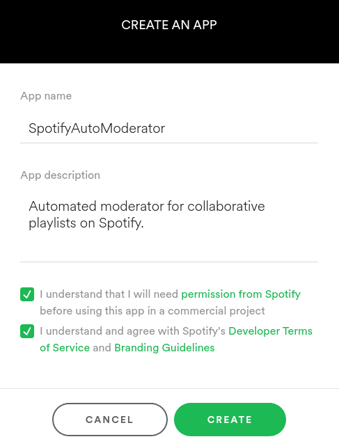
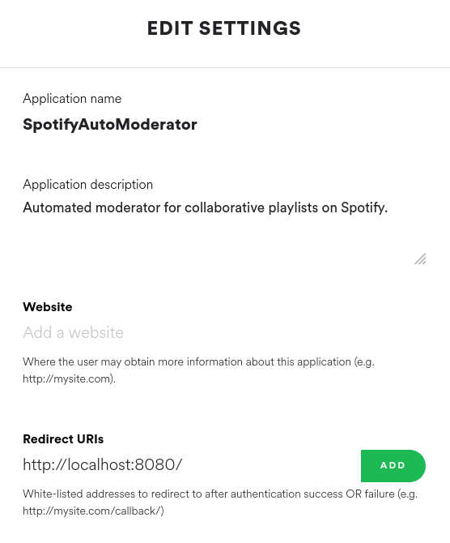

# SpotifyAutoModerator


Automated moderator for collaborative playlists on Spotify.

## The Problem

Spotify's collaborative playlists can be an awesome tool for constructing and sharing unique mixes of music with friends (and more).
However, there are two crucial issues with Spotify's collaborative playlist system that can be a great annoyance for regular users:

* any user can add any track to a public collaborative playlist; and
* any user can remove any track from a public collaborative playlist.

Imagine spending years constructing and managing the perfect <insert your overly specific sub-genre of preference> with your close friends. Now imagine a random Spotify artist to use their burner account to empty your playlist and replace it with their own (extremely underwhelming) music of a completely unrelated sub-genre. A lot of Spotify users don't need to imagine this at all, as it happens regularly. Record label accounts on Spotify have also been seen promoting their artists' music by adding it to irrelevant collaborative playlists. Additionally, general trolls exist on every online platform and Spotify is certainly no exception.

It is obvious that collaborative playlists require protection against such annoyances.

## The Solution

SpotifyAutoModerator monitors all (or a chosen subset of) your collaborative playlists and provides the following services in an attempt to mitigate the aforementioned problem:

* **enforcement of a whitelist of authorized users** - automatic removal of any track additions by users which are not explicitly authorized;
* **enforcement of a blacklist of unauthorized users** - automatic removal of any track additions by users which are explicitly banned from contributing to a particular playlist (or all playlists); and
* **track restoration after unapproved removal** - SpotifyAutoModerator will automatically ask you to approve the removals of tracks from your protected playlists and will restore any tracks that were removed without your approval.

## Installation

### Download the Project Source

To install SpotifyAutoModerator, run the following commands:

``` shell
$> git clone https://github.com/omnimeta/SpotifyAutoModerator.git
$> cd SpotifyAutoModerator
$> ./setup.sh
```

## Register the Application on Your Spotify Dashboard

Register the application at: https://developer.spotify.com/dashboard/login


Once the application is registered, note the generated client ID and client secret, then click the `EDIT SETTINGS` button and add `http://localhost:8080/` as a redirect URI to the application (in the Spotify dashboard). If the port `8080` is in use by some service (e.g., a local web server) on your system then replace `8080` with an unused port number.


Update `ACCOUNT_CONFIG.CLIENT_ID`, `ACCOUNT_CONFIG.CLIENT_SECRET`, and `ACCOUNT_CONFIG.REDIRECT_URI` in `data/config.yaml` based on the details discussed in the previous step:

``` yaml
ACCOUNT_CONFIG:
  CLIENT_ID: ReplaceThisWithYourClientID
  CLIENT_SECRET: ReplaceThisWithYourClientSecret
  REDIRECT_URI: ReplaceThisWithYourRedirectURI
  USERNAME: ReplaceThisWithYourSpotifyUsername
```
As shown above, `ACCOUNT_CONFIG.USERNAME` should be set to your Spotify username (also know as your Spotify ID). **NOTE**: your display name and username may not be the same. To acquire your true username, open your profile in Spotify and copy your Spotify URI. For example, if your Spotify URI is `spotify:user:omnimeta` then your Spotify username/ID is `omnimeta`.

## Usage


### Configure Your Playlist Moderation Settings

Before running SpotifyAutoModerator, you must configure your playlist moderation settings in `data/config.yaml`.

#### Global Configuration

The global configuration applies to all of your protected collaborative playlists and can be found under the `PLAYLIST_CONFIG` dictionary in `data/config.yaml`.
The following is an _example_ of a global playlist configuration:
``` yaml
PLAYLIST_CONFIG:
  DELAY_BETWEEN_SCANS: 120
  PROTECT_ALL: false
  GLOBAL_MODE: blacklist
  GLOBAL_WHITELIST:
    - spotifyusername1
    - spotifyusername2
  GLOBAL_BLACKLIST:
    - spotifyusername3
  MAX_BACKUPS_PER_PLAYLIST: 1
  BACKUP_PATH: data/backups
```

When the application is run in loop mode, **`DELAY_BETWEEN_SCANS`** determines how many seconds the application will wait for, after completing each iteration, before starting a new iteration of playlist moderation. During this delay you will have the ability to quit the application.

**`PROTECT_ALL`** determines whether the application will moderate all, or only a particular subset, of your collaborative playlists. It can take a value of either `true` or `false`, where `false` means only a chosen subset of your collaborative playlists will be moderated.

**`GLOBAL_WHITELIST`** is a list of Spotify usernames/IDs which are explicitly _authorized_ to contribute to all of your protected playlists. If a whitelisted user adds to one of your protected playlists, the addition will be considered authorized unless the user is explicitly blacklisted in the playlist's own (playlist-specific) configuration (which is discussed further in the following sub-section).

**`GLOBAL_BLACKLIST`** is a list of Spotify usernames/IDs which are explicitly _unauthorized_ to contribute to all of your protected playlists. If a blacklisted user adds to one of your protected playlists, the addition will be considered unauthorized unless the user is explicitly whitelisted in the playlists own (playlist-specific) configuration (which is discussed further in the following sub-section).

**`GLOBAL_MODE`** determines how users are authorized at the global level (if they are not explicitly authorized or unauthorized at the playlist level). It can take a value of either `whitelist` or `blacklist`. Additionally, if a protected playlist does not have its own configuration, or has its own configuration but does not have its own whitelist/blacklist, then `GLOBAL_MODE` will determine if the playlist will be moderated based on `GLOBAL_WHITELIST` or `GLOBAL_BLACKLIST`.

**`MAX_BACKUPS_PER_PLAYLIST`** determines the maximum number of stored backups for each of your protected playlists. SpotifyAutoModerator detects the removal of tracks from your playlist by comparing the current state of the playlist with a past state (acquired from a backup file). Consequently, this setting should be no less than 1, although a value of 1 is suitable for the vast majority of use cases.

**`BACKUP_PATH`** determines the directory in which backups of your protected playlists will be stored. The default path `data/backups` should be suitable for the vast majority of use cases.

**NOTE**: rememeber, to acquire the username of a Spotify user, go to their user page and copy their Spotify URI. You can then retrieve the ID from the end of the URI (after `spotify:user:`). _DO NOT_ simply use the user's display name, as this may not match their ID.


#### Playlist-Specific Configuration

The playlist-specific configuration is represented by the list `PLAYLIST_CONFIG.PROTECTED_PLAYLISTS` which can be found under the aforementioned global configuration in `data/config.yaml`.
The following is an _example_ of a playlist-specific configuration:

``` yaml
PLAYLIST_CONFIG:
  # some global configuration (as described in the previous sub-section) ...

  PROTECTED_PLAYLISTS:
    - ProgressiveJazzFusion:
        uri: spotify:playlist:xxxxxxxxxxxxxxxxxxxxxx
        whitelist:
          - spotifyusername1
          - spotifyusername2

    - ProkofievConcertoMix:
        uri: spotify:playlist:xxxxxxxxxxxxxxxxxxxxxx
        blacklist:
          - spotifyusername3
```

The above example configures moderation settings for two distinct playlists, where `ProgressiveJazzFusion` and `ProkofievConcertoMix` simply act as arbitrary labels (to help you identify which playlist is which). The labels you choose are not important, but must be valid strings (of text).

The **`uri`** property of each protected playlist refers to the playlist's URI and identifies the collaborative playlist to the application. A playlist's URI is used to acquire information about and make changes to the playlist (via Spotify's playlist API). You can acquire the URI of as collaborative playlist by opening it in Spotify, and selecting 'Copy URI' from the share options. 

The **`whitelist`** property of each protected playlist identifies a list of Spotify usernames/IDs which are explicitly _authorized_ to contribute to the particular playlist. If a user listed in `whitelist` adds to the playlist, the addition will be considered authorized.

The **`blacklist`** property of each protected playlist identifies a list of Spotify usernames/IDs which are explicitly _unauthorized_ to contribute to the particular playlist. If a user listed in `blacklist` adds to the playlist, the track addition will be considered unauthorized (and will subsequently be removed from the playlist).

**NOTE: each playlist-specific configuration can have either a `whitelist` or a `blacklist` for determining if track additions are authorized or not. If a playlist has both lists then the `blacklist` will be used and the `whitelist` will be ignored.**

#### How Unauthorized Track Additions are Determined

When a Spotify user adds a track to one of your protected playlists, SpotifyAutoModerator will consider the addition to be authorized if and only if:

* if the the user is you, i.e., the track was added by the creator of the playlist, or
* the user is explicitly _authorized_ at the _playlist-level_ because
  * the playlist's own configuration has a `whitelist` which _includes_ the user's username/ID, or
  * the playlist's own configuration has a `blacklist` (and no `whitelist`) which does _not include_ the user's username/ID; or
* the user is _not_ explicitly _unauthorized_ at the _playlist-level_ and the user is explicitly _authorized_ at the `global level`` because
  * the global `GLOBAL_MODE` is `blacklist` and the user's username/ID is _not included_ in the `GLOBAL_BLACKLIST`, or
  * the global `GLOBAL_MODE` is `whitelist` and the user's username/ID is _included_ in the `GLOBAL_WHITELIST`.
  
This means that a track addition to a protected playlist must be either authorized at the playlist-level, or must be not explicitly unauthorized at the playlist level and be explicitly authorized at the global level. Consequently, playlist-specific settings (in `PROTECTED_PLAYLISTS`) override global settings.

At each level (i.e., local/playlist and global), only the blacklist or only the whitelist at that level can be used to determine authorization. This is because a whitelist makes a blacklist redundant (and vice versa). For example, imagine a playlist has both a blacklist and a whitelist. Every non-blacklisted user can add tracks to the playlist, so why would a whitelist be needed to specify which users can add to the playlist if, instead, those users could simply be excluded from the blacklist. The same argument works in reverse. Hence, `GLOBAL_MODE` allows you to keep both a global whitelist and global blacklist in your configuration but choose which one is used at any time.

#### Playlist Configuration Examples

The following **relatively complex example** is intended to aid understanding of the authorization logic:
``` yaml
PLAYLIST_CONFIG:
  DELAY_BETWEEN_SCANS: 120
  PROTECT_ALL: false
  GLOBAL_MODE: blacklist
  MAX_BACKUPS_PER_PLAYLIST: 1
  BACKUP_PATH: data/backups
  GLOBAL_WHITELIST:
    - spotifyuser1
  GLOBAL_BLACKLIST:
    - spotifyuser2
  PROTECTED_PLAYLISTS:
    - ProgressiveJazzFusion:
        uri: spotify:playlist:xxxxxxxxxxxxxxxxxxxxxx
        whitelist:
          - spotifyuser3
    - ProkofievConcertoMix:
        uri: spotify:playlist:xxxxxxxxxxxxxxxxxxxxxx
        whitelist:
          - spotifyuser2
    - Instrudjental:
        uri: spotify:playlist:xxxxxxxxxxxxxxxxxxxxxx
    - ModernAlternativeRnB:
        uri: spotify:playlist:xxxxxxxxxxxxxxxxxxxxxx
        blacklist:
          - spotifyuser4
```

What does this example mean?

* When the playlist is run in loop mode, it will wait 120 seconds (i.e., two minutes) after each cycle of scanning all of the user's protected playlists before starting a new cycle. During this cycle the user will be able to quit.
* Only the four playlists listed in the `PROTECTED_PLAYLISTS` list will be moderated; SpotifyAutoModerator will not interact with any other of the user's collaborative playlists.
* Authorization at the global level is determined based on the global blacklist. This means the whitelist will be ignored when determining authorization at the global level. 
* Only one backup of protected playlists will be stored at a time in the `data/backups` directory.
* `spotifyuser1`:
  * cannot add tracks to `ProgressiveJazzFusion` because the user is not whitelisted in `ProgressiveJazzFusion`;
  * cannot add tracks to `ProkofievConcertoMix` because the user is not whitelisted in `ProkofievConcertoMix`;
  * can add tracks to `Instrudjental` because the playlist has no whitelist/blacklist, the global mode is `blacklist`, and the user is not globally blacklisted;
  * can add tracks to `ModernAlternativeRnB` because the user is blacklisted in `ModernAlternativeRnB`.
* `spotifyuser2`:
  * cannot add tracks to `ProgressiveJazzFusion` because the user is not whitelisted in `ProgressiveJazzFusion`;
  * can add tracks to `ProkofievConcertoMix` because the user is whitelisted in `ProkofievConcertoMix`;
  * cannot add tracks to `Instrudjental` because the playlist has no whitelist/blacklist, the global mode is `blacklist`, and the user is globally blacklisted;
  * can add tracks to `ModernAlternativeRnB` because the user is not blacklisted in `ModernAlternativeRnB`.
* `spotifyuser3`:
  * can add tracks to `ProgressiveJazzFusion` because the user is whitelisted in `ProgressiveJazzFusion`;
  * cannot add tracks to `ProkofievConcertoMix` because the user is not whitelisted in `ProkofievConcertoMix`;
  * can add tracks to `Instrudjental` because the playlist has no whitelist/blacklist, the global mode is `blacklist`, and the user is not globally blacklisted;
  * can add tracks to `ModernAlternativeRnB` because the user is not blacklisted in `ModernAlternativeRnB`.
* `spotifyuser4`:
  * cannot add tracks to `ProgressiveJazzFusion` because the user is not whitelisted in `ProgressiveJazzFusion`;
  * cannot add tracks to `ProkofievConcertoMix` because the user is not whitelisted in `ProkofievConcertoMix`;
  * can add tracks to `Instrudjental` because the playlist has no whitelist/blacklist, the global mode is `blacklist`, and the user is not globally blacklisted;
  * cannot add tracks to `ModernAlternativeRnB` because the user is blacklisted in `ModernAlternativeRnB`.
  

The structure of the following **simple example** is likely to be applicable to many users:
``` yaml
PLAYLIST_CONFIG:
  DELAY_BETWEEN_SCANS: 120
  PROTECT_ALL: false
  GLOBAL_MODE: whitelist
  MAX_BACKUPS_PER_PLAYLIST: 1
  BACKUP_PATH: data/backups
  GLOBAL_WHITELIST:
    - friendaccount1
    - friendaccount2
    - friendaccount3
  PROTECTED_PLAYLISTS:
    - ProgressiveJazzFusion:
        uri: spotify:playlist:xxxxxxxxxxxxxxxxxxxxxx
    - ProkofievConcertoMix:
        uri: spotify:playlist:xxxxxxxxxxxxxxxxxxxxxx
    - Instrudjental:
        uri: spotify:playlist:xxxxxxxxxxxxxxxxxxxxxx
    - ModernAlternativeRnB:
        uri: spotify:playlist:xxxxxxxxxxxxxxxxxxxxxx
        blacklist:
          - spotifyuser1
```

In this example, the global mode is whitelist and three accounts (representing the user's friends) are whitelisted. The three friend accounts can therefore add to the first three listed playlists (which do not explicitly blacklist any of them), and are also able to add to `ModernAlternativeRnB` because it has an explicit blacklist in which they are not included. `ModernAlternativeRnB` can be added to by any user (including those not listed in this configuration) except `spotifyuser1` because the playlist has its own blacklist in which the user is the sole constituent. Only the four listed collaborative playlists are moderated as `PROTECT_ALL` is `false`.

### Running the Application

Once your account and playlist settings have been appropriately configured in `data/config.yaml`, you can run the application from the project root directory (i.e., the directory name `SpotifyAutoModerator`) using the `spautomod` executable:

``` shell
$> ./spautomod [options]
```

Available options:

* `-h, --help` - show help information for command usage;
* `--rdc` - restore default configuration file;
* `-l, -loop` - run in loop mode (i.e., run continously in cycles until the user asks to quit).

### Run One Iteration of Playlist Moderation

To scan each of your protected playlists once (handling unauthorized additions and removals appropriately) and then quit:

``` shell
$> ./spautomod
```

### Continuously Moderate Playlists

Loop mode can be used to run SpotifyAutoModerator continuously until you ask the application to stop. In loop mode, the application will moderate your playlists in iterations and you will have the opportunity to request to quit between iterations. Use the `-l` or `--loop` options to run the application continuously:

``` shell
$> ./spautomod -l
```
or
``` shell
$> ./spautomod --loop
```

## Project Roadmap

The following are the current goals of the project:
* add more complex integration tests;
* vulnerability scanning of sourced libraries/packages.
